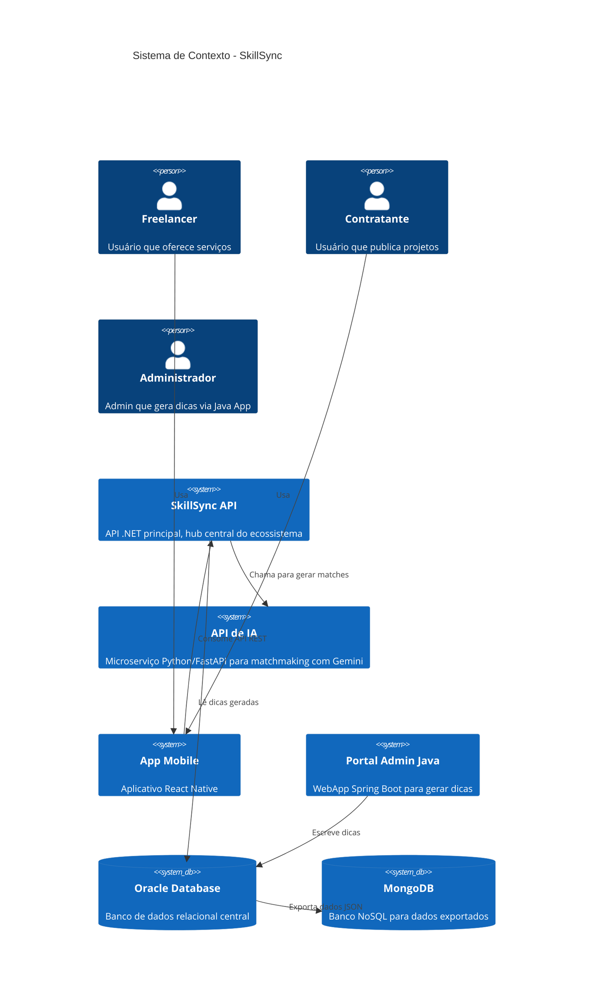

# SkillSync API

API RESTful desenvolvida em .NET 8 para a plataforma SkillSync, focada em matchmaking de freelancers e projetos usando Inteligência Artificial.

## 📋 Índice

- [Visão Geral](#-visão-geral)
- [Arquitetura](#-arquitetura)
- [Requisitos](#-requisitos)
- [Configuração](#-configuração)
- [Uso da API](#-uso-da-api)
- [Deploy](#-deploy)
- [Testes](#-testes)
- [Estrutura do Projeto](#-estrutura-do-projeto)

## 🎯 Visão Geral

A SkillSync API é o núcleo do ecossistema SkillSync, uma plataforma de matchmaking entre freelancers e projetos utilizando Inteligência Artificial. A API oferece:

- **Autenticação JWT** para segurança
- **Versionamento de API** (v1.0 e v2.0)
- **Integração com Oracle Database** usando Entity Framework Core
- **Integração com API de IA** (Python/FastAPI) para matchmaking inteligente
- **ML.NET** para classificação automática de categorias de projetos
- **Health Checks** para monitoramento
- **Logging estruturado** com Serilog
- **Swagger/OpenAPI** para documentação interativa

## 🏗️ Arquitetura

### Diagrama C4 Model - Contexto (Level 1)



### Diagrama C4 Model - Container (Level 2)

```mermaid
C4Container
    title Container - SkillSync API

    Person(user, "Usuário", "Freelancer ou Contratante")

    System_Ext(mobile_app, "App Mobile", "React Native")
    System_Ext(ai_api, "API de IA", "Python/FastAPI")
    SystemDb_Ext(oracle_db, "Oracle Database", "Banco de dados relacional")

    Container(skillsync_api, "SkillSync API", ".NET 8, ASP.NET Core", "API RESTful principal")
    ContainerDb(oracle_db_container, "Oracle Database", "Oracle", "Armazena usuários, projetos, perfis, dicas")

    Container_Opt(auth_controller, "AuthController", "C#", "Autenticação JWT")
    Container_Opt(projetos_controller, "ProjetosController", "C#", "CRUD de projetos")
    Container_Opt(perfis_controller, "PerfisController", "C#", "CRUD de perfis")
    Container_Opt(dicas_controller, "DicasController", "C#", "Listagem de dicas")
    Container_Opt(matches_controller, "MatchesController", "C#", "Geração de matches")
    
    Container_Opt(ml_service, "MLService", "C#", "Classificação ML.NET")
    Container_Opt(ai_service, "AIService", "C#", "Integração com API de IA")
    Container_Opt(auth_service, "AuthService", "C#", "Autenticação e registro")

    Rel(user, mobile_app, "Usa")
    Rel(mobile_app, skillsync_api, "HTTPS")
    Rel(skillsync_api, auth_controller, "Usa")
    Rel(skillsync_api, projetos_controller, "Usa")
    Rel(skillsync_api, perfis_controller, "Usa")
    Rel(skillsync_api, dicas_controller, "Usa")
    Rel(skillsync_api, matches_controller, "Usa")
    Rel(projetos_controller, ml_service, "Usa")
    Rel(matches_controller, ai_service, "Usa")
    Rel(auth_controller, auth_service, "Usa")
    Rel(skillsync_api, ai_api, "HTTPS")
    Rel(skillsync_api, oracle_db, "Entity Framework Core")
    Rel(projetos_controller, oracle_db_container, "Lê/Escreve")
    Rel(perfis_controller, oracle_db_container, "Lê/Escreve")
    Rel(dicas_controller, oracle_db_container, "Lê")
```

## 📋 Requisitos

- **.NET 8.0 SDK** ou superior
- **Oracle Database** (com schema SkillSync criado)
- **Git** para clonar o repositório

## 🚀 Configuração

### 1. Clonar o Repositório

```bash
git clone https://github.com/gtheox/SkillSync-API.git
cd SkillSync-API/Dotnet
```

### 2. Restaurar Dependências

```bash
dotnet restore
```

### 3. Executar a API

```bash
# Usando script helper
./start-api.sh

# Ou diretamente
dotnet run --project SkillSync.API
```

A API estará disponível em:
- **Swagger UI**: `http://localhost:5004`
- **API**: `http://localhost:5004/api/v1`
- **Health Check**: `http://localhost:5004/health`

## 📚 Uso da API

### Autenticação

A API utiliza JWT (JSON Web Tokens) para autenticação. Todos os endpoints protegidos requerem o header `Authorization: Bearer {token}`.

#### Registrar Usuário

```http
POST /api/v1/auth/register
Content-Type: application/json

{
  "nome": "João Silva",
  "email": "joao@example.com",
  "senha": "Senha123!",
  "role": "FREELANCER"
}
```

**Resposta (201 Created):**
```json
{
  "email": "joao@example.com",
  "role": "FREELANCER",
  "idUsuario": 1,
  "message": "Usuário registrado com sucesso. Faça login para obter o token."
}
```

#### Login

```http
POST /api/v1/auth/login
Content-Type: application/json

{
  "email": "joao@example.com",
  "senha": "Senha123!"
}
```

**Resposta (200 OK):**
```json
{
  "token": "eyJhbGciOiJIUzI1NiIsInR5cCI6IkpXVCJ9...",
  "email": "joao@example.com",
  "role": "FREELANCER",
  "idUsuario": 1
}
```

### Endpoints Principais

#### Projetos

- `GET /api/v1/projetos` - Listar projetos (com paginação)
- `GET /api/v1/projetos/{id}` - Buscar projeto por ID
- `POST /api/v1/projetos` - Criar novo projeto (requer autenticação)
- `PUT /api/v1/projetos/{id}` - Atualizar projeto (requer autenticação)
- `DELETE /api/v1/projetos/{id}` - Deletar projeto (requer autenticação)
- `POST /api/v1/projetos/{id}/gerar-matches` - Gerar matches usando IA (requer autenticação)

#### Perfis

- `GET /api/v1/perfis` - Listar perfis
- `GET /api/v1/perfis/{id}` - Buscar perfil por ID
- `POST /api/v1/perfis` - Criar novo perfil (requer autenticação)
- `PUT /api/v1/perfis/{id}` - Atualizar perfil (requer autenticação)
- `DELETE /api/v1/perfis/{id}` - Deletar perfil (requer autenticação)

#### Dicas

- `GET /api/v1/dicas` - Listar dicas geradas pela IA
- `GET /api/v1/dicas/{id}` - Buscar dica por ID

#### Health Check

- `GET /health` - Verificar saúde da API e banco de dados

### Versionamento

A API suporta versionamento através do prefixo `/api/v{version}/`:

- **v1.0**: Versão inicial da API
- **v2.0**: Versão com filtros avançados e ML.NET melhorado

### Swagger UI

Acesse `http://localhost:5004` para visualizar a documentação interativa da API. Use o botão "Authorize" para incluir o token JWT nas requisições.

### Exemplo de Uso Completo

```bash
# 1. Registrar usuário
curl -X POST "http://localhost:5004/api/v1/auth/register" \
  -H "Content-Type: application/json" \
  -d '{
    "nome": "João Silva",
    "email": "joao@example.com",
    "senha": "Senha123!",
    "role": "CONTRATANTE"
  }'

# 2. Login
TOKEN=$(curl -X POST "http://localhost:5004/api/v1/auth/login" \
  -H "Content-Type: application/json" \
  -d '{
    "email": "joao@example.com",
    "senha": "Senha123!"
  }' | jq -r '.token')

# 3. Criar projeto
curl -X POST "http://localhost:5004/api/v1/projetos" \
  -H "Authorization: Bearer $TOKEN" \
  -H "Content-Type: application/json" \
  -d '{
    "titulo": "Desenvolvimento de API REST",
    "descricao": "Preciso de um desenvolvedor para criar uma API REST",
    "orcamento": 5000.00,
    "habilidadesRequisitadas": [1, 2]
  }'

# 4. Gerar matches
curl -X POST "http://localhost:5004/api/v1/projetos/1/gerar-matches" \
  -H "Authorization: Bearer $TOKEN"
```

## 🚀 Deploy

### Deploy no Render (Gratuito)

Render oferece um tier gratuito para aplicações .NET. Siga os passos abaixo:

#### 1. Preparar o Projeto

Certifique-se de que o projeto possui um `Dockerfile` na raiz do diretório `Dotnet`:

```dockerfile
FROM mcr.microsoft.com/dotnet/aspnet:8.0 AS base
WORKDIR /app
EXPOSE 8080
ENV ASPNETCORE_URLS=http://+:8080

FROM mcr.microsoft.com/dotnet/sdk:8.0 AS build
WORKDIR /src
COPY ["SkillSync.API/SkillSync.API.csproj", "SkillSync.API/"]
RUN dotnet restore "SkillSync.API/SkillSync.API.csproj"
COPY . .
WORKDIR "/src/SkillSync.API"
RUN dotnet build "SkillSync.API.csproj" -c Release -o /app/build

FROM build AS publish
RUN dotnet publish "SkillSync.API.csproj" -c Release -o /app/publish /p:UseAppHost=false

FROM base AS final
WORKDIR /app
COPY --from=publish /app/publish .
ENTRYPOINT ["dotnet", "SkillSync.API.dll"]
```

#### 2. Criar Web Service no Render

1. Acesse [render.com](https://render.com) e crie uma conta
2. Clique em "New +" e selecione "Web Service"
3. Conecte seu repositório GitHub
4. Configure o serviço:
   - **Name**: `skillsync-api`
   - **Environment**: `Docker`
   - **Region**: Escolha a região mais próxima
   - **Branch**: `main`
   - **Root Directory**: `Dotnet`
   - **Dockerfile Path**: `Dockerfile`
   - **Docker Context**: `Dotnet`

#### 3. Configurar Variáveis de Ambiente

No painel do Render, adicione as seguintes variáveis de ambiente:

```
ConnectionStrings__OracleConnection=User Id=SEU_USUARIO;Password=SUA_SENHA;Data Source=oracle.fiap.com.br:1521/ORCL;
Jwt__Key=SUA_CHAVE_SECRETA_MINIMO_32_CARACTERES
Jwt__Issuer=SkillSyncAPI
Jwt__Audience=SkillSyncUsers
Jwt__ExpirationInMinutes=60
AI__ApiUrl=https://skillsync-ai-api.onrender.com/gerar-match
AI__TimeoutInSeconds=30
ASPNETCORE_ENVIRONMENT=Production
ASPNETCORE_URLS=http://+:8080
```

#### 4. Deploy

Clique em "Create Web Service" e aguarde o deploy. A API estará disponível em `https://skillsync-api.onrender.com`.

### Deploy no Railway (Gratuito)

Railway oferece um tier gratuito com $5 de créditos mensais. Siga os passos abaixo:

#### 1. Preparar o Projeto

Certifique-se de que o projeto possui um `Dockerfile` (mesmo do Render).

#### 2. Criar Projeto no Railway

1. Acesse [railway.app](https://railway.app) e crie uma conta
2. Clique em "New Project" e selecione "Deploy from GitHub repo"
3. Conecte seu repositório GitHub
4. Selecione o repositório `SkillSync-API`

#### 3. Configurar o Serviço

1. Railway detectará automaticamente o `Dockerfile`
2. Configure o **Root Directory** como `Dotnet`
3. Railway iniciará o build automaticamente

#### 4. Configurar Variáveis de Ambiente

No painel do Railway, adicione as seguintes variáveis de ambiente:

```
ConnectionStrings__OracleConnection=User Id=SEU_USUARIO;Password=SUA_SENHA;Data Source=oracle.fiap.com.br:1521/ORCL;
Jwt__Key=SUA_CHAVE_SECRETA_MINIMO_32_CARACTERES
Jwt__Issuer=SkillSyncAPI
Jwt__Audience=SkillSyncUsers
Jwt__ExpirationInMinutes=60
AI__ApiUrl=https://skillsync-ai-api.onrender.com/gerar-match
AI__TimeoutInSeconds=30
ASPNETCORE_ENVIRONMENT=Production
PORT=8080
```

#### 5. Deploy

Railway fará o deploy automaticamente. A API estará disponível em `https://skillsync-api.railway.app`.

### Deploy no Fly.io (Gratuito)

Fly.io oferece um tier gratuito com recursos limitados. Siga os passos abaixo:

#### 1. Instalar Fly CLI

```bash
curl -L https://fly.io/install.sh | sh
```

#### 2. Criar App no Fly.io

```bash
cd Dotnet
fly launch
```

#### 3. Configurar Variáveis de Ambiente

```bash
fly secrets set ConnectionStrings__OracleConnection="User Id=SEU_USUARIO;Password=SUA_SENHA;Data Source=oracle.fiap.com.br:1521/ORCL;"
fly secrets set Jwt__Key="SUA_CHAVE_SECRETA_MINIMO_32_CARACTERES"
fly secrets set Jwt__Issuer="SkillSyncAPI"
fly secrets set Jwt__Audience="SkillSyncUsers"
fly secrets set Jwt__ExpirationInMinutes="60"
fly secrets set AI__ApiUrl="https://skillsync-ai-api.onrender.com/gerar-match"
fly secrets set AI__TimeoutInSeconds="30"
```

#### 4. Deploy

```bash
fly deploy
```

A API estará disponível em `https://skillsync-api.fly.dev`.

### Notas sobre Deploy

- **Render**: Tier gratuito com limitações de recursos. A aplicação pode "adormecer" após 15 minutos de inatividade.
- **Railway**: Tier gratuito com $5 de créditos mensais. Ideal para projetos pequenos.
- **Fly.io**: Tier gratuito com recursos limitados. Ideal para projetos experimentais.

Para produção, considere usar um plano pago ou configurar um servidor próprio.

## 🧪 Testes

### Executar Testes

```bash
dotnet test
```

### Executar Testes com Cobertura

```bash
dotnet test --collect:"XPlat Code Coverage"
```

### Testes Disponíveis

Os testes de integração estão em `SkillSync.API.Tests` e incluem:

- Testes de autenticação (registro, login)
- Testes de controllers (projetos, perfis)
- Testes de health check

## 📦 Estrutura do Projeto

```
SkillSync.API/
├── Controllers/
│   ├── V1/
│   │   ├── AuthController.cs
│   │   ├── ProjetosController.cs
│   │   ├── PerfisController.cs
│   │   ├── DicasController.cs
│   │   └── MatchesController.cs
│   └── V2/
│       └── ProjetosV2Controller.cs
├── Data/
│   └── SkillSyncDbContext.cs
├── DTOs/
│   ├── Auth/
│   ├── Projeto/
│   ├── Perfil/
│   ├── Dica/
│   └── AI/
├── Helpers/
│   └── JwtHelper.cs
├── Models/
│   └── (Entidades do banco de dados)
├── Services/
│   ├── IAuthService.cs
│   ├── AuthService.cs
│   ├── IAIService.cs
│   ├── AIService.cs
│   ├── IMLService.cs
│   └── MLService.cs
├── ML/
│   └── (Modelos ML.NET)
├── Program.cs
└── appsettings.json

SkillSync.API.Tests/
├── AuthControllerTests.cs
├── ProjetosControllerTests.cs
└── HealthCheckTests.cs
```

## 🔧 Configurações

### Logging

O projeto utiliza Serilog para logging estruturado. Os logs são escritos em:
- **Console** (desenvolvimento)
- **Arquivo** (`logs/skillsync-*.log`)

### Health Checks

O endpoint `/health` verifica:
- Conexão com o banco de dados Oracle
- Status da API
- Informações detalhadas de cada check

### CORS

CORS está configurado para permitir todas as origens em desenvolvimento. Para produção, configure origens específicas no `Program.cs`.

## 📝 Notas Importantes

- A API utiliza procedures do Oracle para operações de escrita (INSERT, UPDATE, DELETE)
- O modelo ML.NET é treinado automaticamente quando há dados suficientes no banco
- A integração com a API de IA Python é assíncrona e utiliza HttpClient
- Todos os endpoints protegidos requerem autenticação JWT
- O Swagger está disponível apenas em desenvolvimento por padrão
- Cada usuário pode ter apenas um perfil (constraint `UK_GS_PERFIS_USUARIO`)

## 🔗 Links

- [Repositório GitHub](https://github.com/gtheox/SkillSync-API)
- [API de IA](https://skillsync-ai-api.onrender.com) - Microserviço de IA Generativa

## 📄 Licença

Este projeto é parte do trabalho acadêmico do curso de Advanced Business Development with .NET.
